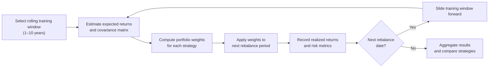

# Out-of-Sample Evaluation of Portfolio Optimization Methods Under Estimation Uncertainty

[](https://github.com/marieltv/portfolio_optimization/actions)
[](https://www.python.org/)
[](https://portfolio-optimisation.streamlit.app)

## 1. Business Problem

Asset managers and quantitative analysts face a consistent challenge: selecting an allocation strategy that is robust out-of-sample, not just historically attractive. Mean-variance optimisation has been the industry standard since the work of Harry Markowitz (1952), yet in practice it is well-documented to be highly sensitive to estimation error — small changes in expected return inputs produce dramatically different, often extreme portfolios.

This project addresses two operational questions directly relevant to portfolio management:

1. **Which allocation strategy delivers the best risk-adjusted return when deployed forward in time** — not fitted to history?
2. **How accurately does each strategy predict its own performance** — and which strategies should be trusted when their assumptions are violated by regime change?

The predicted vs actual framework makes estimation error visible and measurable, rather than burying it in aggregate backtest statistics. This is directly applicable to strategy selection, risk budgeting, and model validation workflows at asset management firms.

---
## 2. Solution Overview & Technology Stack

## Strategies 

Because return estimates are noisy, this project focused on risk-based and regularized portfolio optimization and  all methods were evaluated using rolling out-of-sample backtests.

| Strategy | Estimation inputs | Purpose | Strength | Weakness | 
|---|---|--- |---|---|
| Equal Weight | None — 1/N baseline | Baseline | Very robust baseline |Ignores risk structure |
| Minimum Variance | Covariance only | Risk control | Good downside protection | Sensitive to covariance estimation |
| Risk Parity | Covariance only | Robust allocation | Diversified risk exposure | Requires stable covariance |
| Regularised Max Sharpe | Mean + Covariance, L2 penalty | Active tilt | Strong theoretical foundation | Unstable with noisy returns |

## Metrics

Each strategy is evaluated across return, risk, and efficiency dimensions:

| Return Quality | Risk |
|---|---|
| Annualised Return (CAGR) | Annualised Volatility |
| Sharpe Ratio | Maximum Drawdown |
| Sortino Ratio | CVaR (95%) |
| Calmar Ratio | — |

**Turnover** is tracked separately per rebalance — higher turnover means higher transaction costs in production.

Additionally, each rebalance records **predicted vs realised** Sharpe, Sortino, and Volatility — measuring how accurately each strategy anticipated its own risk-adjusted performance.

---
## Methodology

The framework employs a rolling walk-forward backtesting procedure: portfolio parameters are estimated on a fixed-length historical window, optimized weights are applied to the next rebalancing period, and the window is then advanced to simulate sequential real-time portfolio management.


**Training** — estimate expected returns and the covariance matrix from the rolling window.

**Weights** — each strategy computes portfolio allocations independently using the same inputs.

**Test** — the weights are held fixed until the next rebalance. No adjustments, no look-ahead.

**Window Update** — the training window slides forward by one month, and the process repeats through the entire out-of-sample period.

---
## Data
Daily adjusted price data is downloaded from **Yahoo Finance** using the Python library **yfinance**.

The pipeline performs:

- price alignment across assets

- return calculation

- missing value handling

---
## Reproducibility

All results in this project are fully reproducible.
The workflow follows a deterministic pipeline:

The repository includes:
- Automated tests  `pytest`
- Continuous integration - GitHub Actions
- Deterministic backtesting - Fixed pipeline 

This ensures the results can be independently verified and extended.

---
## Stack
`Python 3.11` · `scipy (SLSQP)` · `pandas` · `numpy` · `yfinance` · `Streamlit` · `Plotly` · `pytest` · `GitHub Actions`

---- 

## Project structure

```
└── 📁portfolio_optimization
    └── 📁.github
        └── 📁workflows
            ├── ci.yaml
    └── 📁.streamlit
        ├── config.toml
    └── 📁src
        └── 📁portfolio_optimization
            ├── __init__.py
            ├── backtest.py
            ├── config.py
            ├── data.py
            ├── main.py
            ├── metrics.py
            ├── optimization.py
    └── 📁tests
        ├── __init__.py
        ├── test_backtest.py
        ├── test_data.py
        ├── test_metrics.py
        ├── test_optimization.py
    ├── .gitignore
    ├── app.py
    ├── pyproject.toml
    ├── README.md
    └── requirements.txt
```
---
## Quickstart

```bash
git clone https://github.com/marieltv/portfolio_optimization.git
cd portfolio_optimization
pip install -e ".[dev]"
streamlit run app.py
```

[Live demo →](https://optimaalinenportfolio.streamlit.app/)

---

## Tests

```bash
pytest -v
```
---

## Results
Results vary by universe and configuration. The dashboard exposes the full metric breakdown — CAGR, Sharpe, Sortino, Calmar, Max Drawdown, CVaR — alongside the predicted vs actual analysis per rebalance period.

